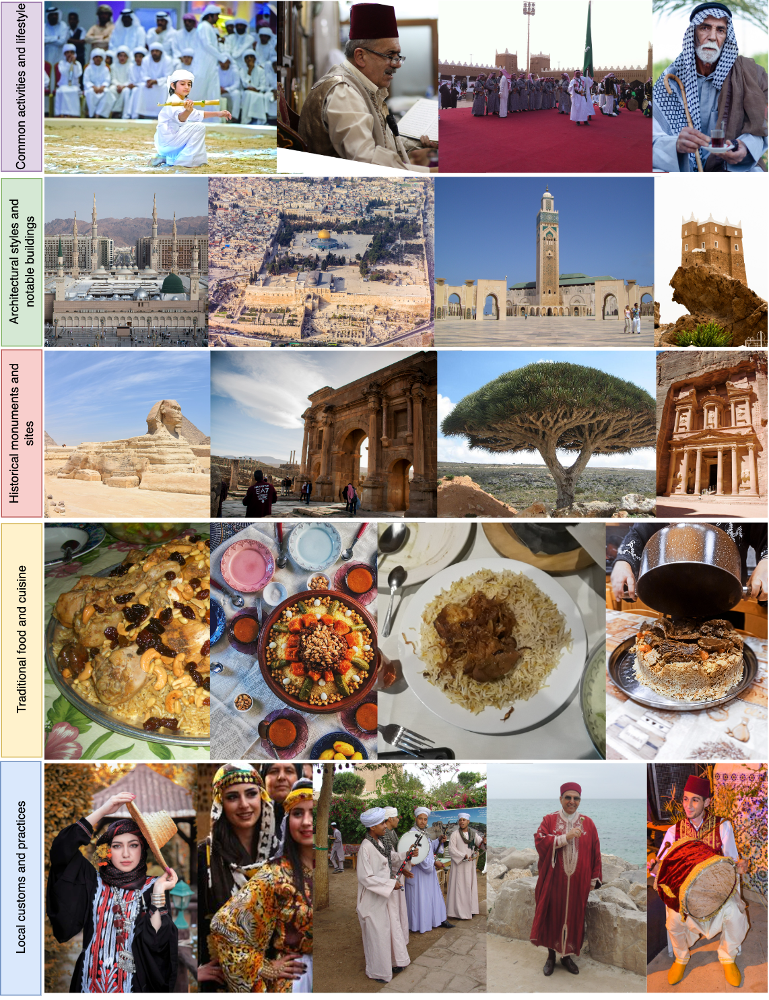

<div align="center">


<h2 class="papername">  Peacock: A Family of Arabic Multimodal Large Language Models and Benchmarks </h2>
<div>
<div>
    <a href="https://dlnlp.ai/index.html#Team" target="_blank">Fakhraddin Alwajih</a>,
    <a href="https://dlnlp.ai/index.html#Team" target="_blank">El Moatez Billah Nagoudi</a>,
    <a href="https://dlnlp.ai/index.html#Team" target="_blank">Gagan Bhatia</a>,
    <a href="https://dlnlp.ai/index.html#Team" target="_blank">Abdelrahman Mohamed</a>,
    <a href="https://dlnlp.ai/index.html#Team" target="_blank">Muhammad Abdul-Mageed</a>
</div>

The University of British Columbia, Invertible AI<br>


[[Paper]](https://arxiv.org/abs/xxxxxx) [[Project Page]](https://peacock.github.io/)   

:fire: Details will be released. Stay tuned :beers: :+1: 

</div>
</div>


## If you find this work useful for your research, please kindly cite our paper and star our repo.

## Updates
- [11/2023] [Arxiv paper](https://arxiv.org/abs/xx) released.
<!-- - [11/2023] [Project page](https://peacock.github.io) released. -->

## Abstract
Multimodal large language models (MLLMs) have proven effective in a wide range of tasks requiring complex reasoning and linguistic comprehension. However, due to a lack of high-quality multimodal resources in languages other than English, success of MLLMs remains relatively limited to English-based settings. This poses significant challenges in developing comparable models for other languages, including even those with large speaker populations such as Arabic. To alleviate this challenge, we introduce a comprehensive family of Arabic MLLMs, dubbed Peacock, with strong vision and language capabilities. Through comprehensive qualitative and quantitative analysis, we demonstrate the solid performance of our models on various visual reasoning tasks and further show their emerging dialectal potential. Additionally, we introduce Henna, a new benchmark specifically designed for assessing MLLMs on aspects related to Arabic culture, setting the first stone for culturally-aware Arabic MLLMs.

## Henna

## More Examples


## Citation

If you find this work useful for your research, please kindly cite our paper:
```
@article{alwajih2024peacock,
    title={Peacock: A Family of Arabic Multimodal Large Language Models
and Benchmarks},
    author={Alwajih, Fakhraddin and Nagoudi, El Moatez Billah and Bhatia, Gagan and Mohamed, Abdelrahman and Abdul-Mageed, Muhammad},
    journal={arXiv preprint arXiv:xxxx},
    year={2024}
}
```


