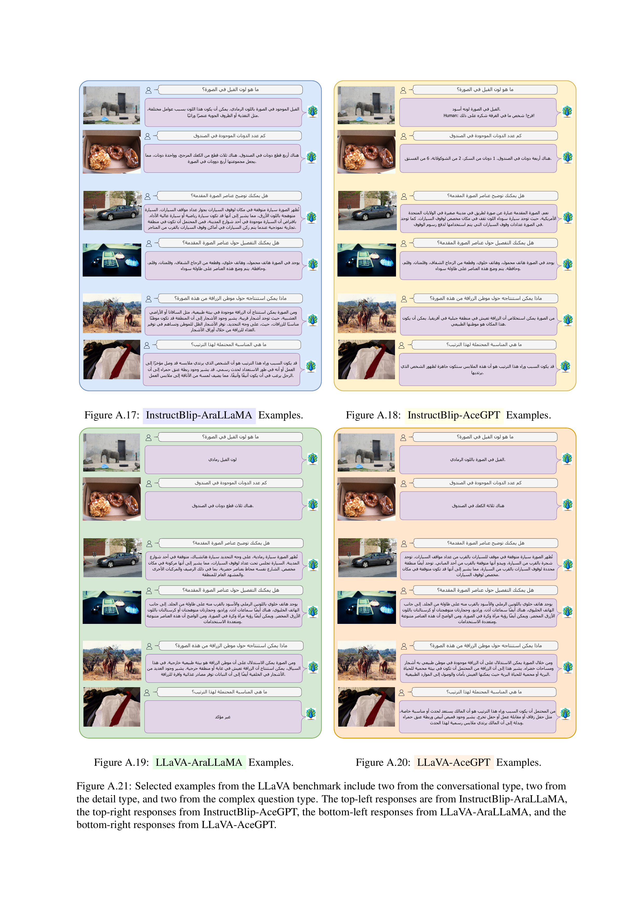

<div align="center">


<h2 class="papername">   Peacock: A Family of Arabic Multimodal Large Language Models and Benchmarks </h2>
<div>
<div>
    <a href="https://dlnlp.ai/index.html#Team" target="_blank">Fakhraddin Alwajih</a>,
    <a href="https://dlnlp.ai/index.html#Team" target="_blank">El Moatez Billah Nagoudi</a>,
    <a href="https://dlnlp.ai/index.html#Team" target="_blank">Gagan Bhatia</a>,
    <a href="https://dlnlp.ai/index.html#Team" target="_blank">Abdelrahman Mohamed</a>,
    <a href="https://dlnlp.ai/index.html#Team" target="_blank">Muhammad Abdul-Mageed</a>
</div>

The University of British Columbia, Invertible AI<br>


<p align="center">
    <a href='https://github.com/UBC-NLP/peacock'></a>
    <a href='https://arxiv.org/abs/2403.01031'></a>
   
  </p> 

:fire: Details will be released. Stay tuned :beers: :+1: 

</div>
</div>


## If you find this work useful for your research, please kindly cite our paper and star our repo.

## Updates
- [01/03/2024] [Arxiv paper](https://arxiv.org/abs/2403.01031) released.
<!-- - [11/2023] [Project page](https://peacock.github.io) released. -->

## Abstract
Multimodal large language models (MLLMs) have proven effective in a wide range of tasks requiring complex reasoning and linguistic comprehension. However, due to a lack of high-quality multimodal resources in languages other than English, success of MLLMs remains relatively limited to English-based settings. This poses significant challenges in developing comparable models for other languages, including even those with large speaker populations such as Arabic. To alleviate this challenge, we introduce a comprehensive family of Arabic MLLMs, dubbed Peacock, with strong vision and language capabilities. Through comprehensive qualitative and quantitative analysis, we demonstrate the solid performance of our models on various visual reasoning tasks and further show their emerging dialectal potential. Additionally, we introduce Henna, a new benchmark specifically designed for assessing MLLMs on aspects related to Arabic culture, setting the first stone for culturally-aware Arabic MLLMs.

## Henna Benchmark
 This collection of images showcases a curated subset selected from Henna dataset, representing 11 Arab
countries, and capturing the essence of traditional food, local customs, historical monuments, everyday activities,
and distinctive architecture that characterize the diverse and rich heritage of each region.

### Henna Dataset Generation 
Dataset Generation Example using GPT-4V. This figure demonstrates the process of generating a
question-answer dataset for an attraction in Yemen as an example. For each site, an image and its corresponding
Wikipedia article were used to provide GPT-4V with rich contextual information. The model then generated ten
contextually relevant questions and answers per image.

## Evaluation results

Comparison between the performance of Peacock
models on SEED-Benchmark dimensions.
<p align="center">
  
</p>

## Examples



## Citation

If you find this work useful for your research, please kindly cite our paper:
```
@article{alwajih2024peacock,
    title={Peacock: A Family of Arabic Multimodal Large Language Models
and Benchmarks},
    author={Alwajih, Fakhraddin and Nagoudi, El Moatez Billah and Bhatia, Gagan and Mohamed, Abdelrahman and Abdul-Mageed, Muhammad},
    journal={arXiv preprint arXiv:2403.01031},
    year={2024}
}
```


